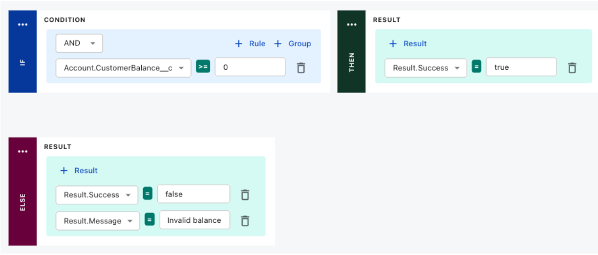

---
seo:
  title: Zuora Rules and Logics - Zuora Developers Blog
markdown:
  toc:
    hide: true
disableLastModified: false
---

# Rules and logic in Zuora

Zuora Billing customers are very diverse and the need a billing platform that has extensibiliy baken in and that can be customized for their individual needs. Our extensibility comes in two flavors:

- **Metadata Configurations** These are built-in configuration options within Zuora that let users enable features and settings to achieve specific billing functionality without writing code.

- **Workflow-based Extensibility** For more advanced use cases, customers can use Zuora Workflow, an automation and orchestration tool that allows them to implement and execute custom business processes that leverage the Zuora API, with Workflow handling the logic, sequencing, and execution of tasks within the Zuora platform.

Our new Custom Logic is a blend of both approaches, we've built a declarative framework that allows customers to embed custom logic with Billing events. The triggering events can be enabled or disabled as desired and for each event custom logic is defined, all by customers without the need for expensive consultants or even developers. For example, one of the most complex aspects of enterprise billing is the process of rating, this is where we take a billable event and assign a price to it. Many customers wanted to provide their own rating logic and we felt a declarative rules engine would be a great fit for this.

Our declarative design means that customers only specify what the rule intends to accomplish \- not how it is accomplished. An example of a rule would be: “you can’t add this product as it’s not available in your country”. Making it declarative separates the expression of intent from the execution. The intent is expressed by the end-customer. The execution is done by Zuora. Since we control the execution logic, we validate and verify before execution, and hence can relax some of the robustness and security guarantees we have to institute when the end-customer provides imperative code like Javascript. This makes the execution a lot faster.

With our 2025 Q1 release, access becomes available to all our Zuora Billing customers regardless of edition at no extra cost, we’re calling it [Custom Logic](https://docs.zuora.com?resourceId=platform-custom-logic-overview). If you’ve already read enough and want to get started with Custom Logic, follow [Custom Logic overview](https://docs.zuora.com?resourceId=platform-custom-logic-overview).

Here we’re peeking behind the curtain. This blog post explains the architecture behind this new feature as well as the implementation choices made.

## ZRules: A declarative rules engine

One of the key distinguishing aspects of Zuora is its full-suite offering for order-to-cash. There are APIs to create orders and a CPQ module that allows for a sales representative to provide guided selling. We decided that we will use the rules engine for all these components and therefore we decided to make the rules engine a true microservice.

To enable scenarios like guided selling during the quote-authoring process, we needed to capture and preserve the state of the entire authoring process which can last hours including rule invocations. For example, the process to create an insurance quote lasts several hours and includes various rules that get executed to add qualifying discounts at every step of the process.

Furthermore, Zuora also offers a consumption billing solution, in which we have to capture events coming from customers, aggregate them and then use rules to determine the price. For all of these we decided to capture the state of computation in a construct called Knowledge Base. In Zuora, the Knowledge Base starts with a collection of rules and facts are added to it. As facts are added the rules fire generating more facts using forward chaining and backward chaining of rules.

At the lowest level, the rules themselves are of the format: **when** \<condition\> **then** \<action\>. It is an association of a condition along with some actions. In a real-life scenario, things however are more complex. Consider an e-commerce customer that uses Zuora order-to-cash offerings. In such a setup, there are campaign managers that target campaigns and offer discounts to those customers. Zuora’s Rules Engine is targeted for these scenarios. There can be hundreds of customers defining hundreds of such rules. We therefore needed a mechanism to manage these rules by grouping them, assigning priorities to those groups.

Rules in Zuora can be grouped into sets called RuleSet. Both Rules and RuleSets have priorities assigned to them to control which rules fire and in what sequence to produce an outcome.

Talking to customers, it became imperative that the rules engine provide a mechanism to explain which rules fired and why. This was also particularly important in the context of rating where we allow for price determination by combinations of attribute values expressed in tabular form.

To author the \<condition\> clauses, it was important to have a well-defined set of entities that all microservices used and the conditions are logical expressions using properties of these objects. Account, Order, Order Line Items, and Subscriptions are some of the objects. We built a metadata repository where the definitions of these objects are captured, and the rules engine uses the metadata repository to validate the rules.

A typical scenario that we wanted to address was: there are 2 or more order line items in the order, and we want to offer a 10% discount on the second item. Rules of the form "**when** \<condition\> **then** \<action\>" were not sufficient to model this kind of scenario computationally. We also did not want to allow loops as that would make reasoning difficult. So we resorted to Prolog-style data-binding. Arguably this can make things complicated for the campaign manager using the system to define rules for their campaigns. So we provide a rich set of out-of-box templates so that they can pick and choose, assign values to the parameters of the templates, and the rules will be autogenerated for them from the templates.

To enable rules to be called from different points in the internal Zuora business process flows, we carefully analyzed which parts of the business processes need such extensions and called them "hook-points". After a ruleset is defined, it can be associated with these hook-points and acts as a rule-based extension mechanism to Zuora’s functionality.

Note that the business process flows in the Order Processing Subsystem does not know about any of these rules. All it knows is that when a new order is created, it should take the Order and Order Line Item objects, convert them to JSON, and call the new rules engine for the **NewOrder** HookPoint. Now the rules engine separates the duties of the programmers who implement the Order Processing functionality from the Campaign Manager who defined the **BuyOneGetOneFree** ruleset.

Let’s further extend our example to include more than one ruleset. Let’s also add a ruleset called **20PerCentOffOnAllPurchases**, a RuleSet defined by a different Campaign Manager but that also needs to be associated with the same **NewOrder** HookPoint. You can set a priority with each RuleSet so when the priorities of the RuleSets are different the Rules are applied in priority order. Now the Rules in one RuleSet do not interfere with the Rules in another RuleSet and you can define scenarios where if one or more rules in the RuleSet **BuyOneGetOneFree** fires, the rules in the other **20PerCentOffOnAllPurchases** RuleSet do not fire.

If the priorities of the RuleSets are the same, then the KnowledgeBase built from the Rules from both RuleSets will be applied to the facts. But Rules within a RuleSet can also have a priority, and Rule application follows those priorities. You have fine grained control over the order of Rule execution.

With these primitives, you can also implement your own form of versioning by simply creating a new RuleSet with an enhanced name, perhaps suffixed with _V2 before "publishing", that is linking the RuleSet with the appropriate HookPoint.

And we added the concept of Rule Templates. Staying with our earlier example, a sample template is:

`when current_day is {BigSaleDay} then make the price of the second {object} free`

The words in curly braces are the template input parameters. You can create a Rule from this Template by filling in the values, replacing `{BigSaleDay}` with the date of this year’s Black Friday, and `{object}` with `laptop`. Another campaign manager might invoke the template to create a different rule:

`when current_day is ThanksGiving then make the price of the second candle free`

## ZRules becomes custom logic

With our GA release a core subset of 'ZRules' functions are exposed as our new Custom Logic feature along with three different ways to define facts, and to capture and invoke rules:

1. [**Decision Tables**](https://docs.zuora.com?resourceId=platform-custom-logic-decision-table-overview)

Each row in the decision table contains a condition, a 'when', and 'then' a result, the action, that can set a field value or returns a status and error message. If there are multiple rows the rows are OR’d together and executed in order from the top.

2. [**Decision Trees**](https://docs.zuora.com?resourceId=platform-custom-logic-decision-tree-overview)

More complex 'when' conditions are supported, ANDs not just ORs. We also added support for an explicit 'else' alternative action if none of the conditions be met.

3. [**Functions**](https://docs.zuora.com?resourceId=platform-custom-logic-function-overview) Your rules in your JavaScript code so much more granular control. You can also specify functions to only fire on object creation or update or both.

In all three options the HookPoint is specified by choosing a business object, Account, Contact, Subscription, and so on. You may have noticed that not every idea in 'ZRules' has been exposed in our initial Custom Logic GA release, there’s much more to come here.

## Technical implementation

Rules in Zuora come in different flavors. You can define rules in many ways:

* In the "**when** \<condition\> **then** \<action\>" format. The \<condition\> logic can be in MVEL syntax also common in Apache Drools. \<action\> is Java code that is compiled into bytecode, or can be Javascript that is compiled using Graal.
* In pure Javascript using Graal
* In DMN format
* Using SQL with SQLLite dialect
* Decision Tables: which are subsequently converted into MVEL rules
* Decision Trees: which are subsequently converted into Javascript

All the dialects above to define rules accepted by the rules engine microservice are industry standards and can be generated using the <a href="https://docs.zuora.com?resourceId=platform-get-started-with-zuora-copilot" target="_blank">Zuora Copilot</a>. It makes rule authoring easy.

Compilation into Java bytecode enables fast evaluation of rules but poses challenges. The rule engine microservice evaluates millions of rules per hour. With each MVEL rule being converted into a bytecode class and without extra precautions, the number of classes would grow over time and thereby increase the JVM metaspace and memory. In addition, out of every JSON type, representing a fact, we generate a Java proxy. We need to control the memory footprint created by these temporary classes too.

Under the covers, the ZRules service has its own custom class-loader and manages the lifetime of these generated classes. When a rule is not being used, the corresponding Bytecode classes are garbage collected. The rules are compiled and the bytecode re-generated again on re-use. Each tenant in the service is given a specific amount of memory to hold these Java classes and we use an LRU mechanism to reclaim memory.

The rules are stored in a database. Long running knowledge sessions are serialized, compressed, and stored on disk from which they can be hydrated later on use. Global state variables are also stored in the database, and cached in memory with all memory updates logged in durable storage for subsequent recovery as needed.

The service itself is stateless and runs in Zuora’s Kubernetes framework called Omni. The cluster grows and shrinks on load and is front ended by a load balancer for other microservices to discover and invoke the service. Internally, the service is a gRPC service. So that there is little network overhead when calling from other microservices.

Our internal testing showed our processing **1M rule evaluations in under 5 minutes**, each triggering **4 rules**.

## Summary

Our solution therefore improves flexibility and customization by:

* **A separation of concerns**: Business users, for example, campaign or pricing managers, can define rules like "Buy One Get One Free" without coding, freeing your developers to only work on system integrations.
* **Being modular & scalable**: Multiple RuleSets can be prioritized and executed dynamically.
* **Providing templates**: Business users can create rules easily using pre-defined templates.
* **Providing a rich UI**: A spreadsheet-style UI for defining rule-based pricing dynamically while also supporting the embedding of custom code.

Custom Logic declaratively extends Zuora Billing, allowing you to define rules without coding. It improves flexibility and reduces time-to-value while enhancing scalability. Crucially we enable non-developers to configure business logic while maintaining performance and modularity.

**Tanmoy Dutta**

SVP Engineering & Chief Architect

