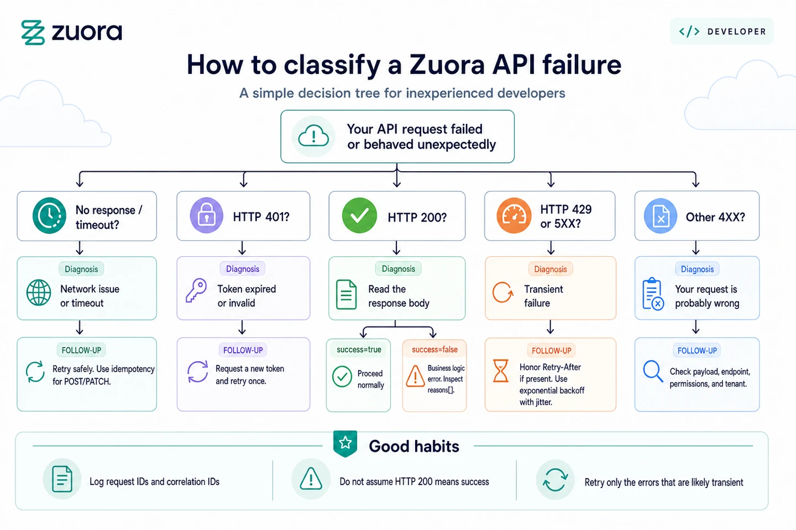

---
seo:
  title: Error handling
  description: Best practices for API error handling in the Zuora v1 API.
  keywords: 'error handling, authentication, HTTP status code, timeout'
markdown:
  toc:
    hide: true
---

# Error handling

How do you ensure your custom integrations and code are resilient to errors? This tutorial describes typical scenarios and related topics such as authentication, HTTP responses, and error handling with the Zuora v1 API.

## Tutorial scope

This tutorial covers the following failure scenarios:

- **Unable to obtain an OAuth token**: Get a token, recover from when they expire.

- **Order creation returns HTTP 200 but includes error code 53100320**: Zuora received your request and processed it without an HTTP error but something in your request is wrong. **HTTP 200 doesn't mean your call succeeded**, you have to read the response body to see if that's the case.

- **Timeouts**: Your code sends a create order request, but the network dies before you get a response. You don't know if the order was created. You retry, but what if the order was created the first time? Now there are two identical orders, which can result in downstream billing issues.

- **Your requests start failing with 429**: You're hitting Zuora's rate limits.




## Authentication and token management

Before you can make any API calls, you need credentials, for Zuora APIs that means OAuth 2.0 credentials. Use your Zuora login or ask an administrator of your Zuora tenant to create a client ID and secret for you. See [Get started](/docs/get-started/introduction/) for a tutorial explaining this process along with a chart to figure out the correct REST endpoint for your tenant. Use your credentials to request a token from the [Create an OAuth token](/v1-api-reference/api/oauth/createtoken) operation. Tokens expire after one hour. When you get a 401 response, request a new token and retry. Cache tokens until near expiration to avoid unnecessary token requests.

Example OAuth token request:

```python
import time
from typing import Optional


import requests
from requests.exceptions import RequestException


DEFAULT_EXPIRES_SECONDS = 3600
REFRESH_SKEW_SECONDS = 300


class AuthenticationError(Exception):
   """Raised when OAuth token acquisition fails."""
   pass


class ZuoraAuth:
   """Minimal OAuth client-credentials token manager for Zuora."""


   def __init__(self, client_id: str, client_secret: str, base_url: str):
       self.client_id = client_id
       self.client_secret = client_secret
       self.base_url = base_url.rstrip("/")
       self.token: Optional[str] = None
       self.token_expires_at_monotonic: Optional[float] = None


   def get_token(self) -> str:
       # if unexpired token is available, return it
       if self.token and self.token_expires_at_monotonic:
           if time.monotonic() < self.token_expires_at_monotonic - REFRESH_SKEW_SECONDS:
               return self.token


       # request new token
       try:
           response = requests.post(
               f"{self.base_url}/oauth/token",
               data={
                   "client_id": self.client_id,
                   "client_secret": self.client_secret,
                   "grant_type": "client_credentials",
               },
               headers={"Content-Type": "application/x-www-form-urlencoded"},
               timeout=(5, 10),
           )
       except RequestException as e:
           raise AuthenticationError(f"Token request failed: {e}") from e


       if not response.ok:
           raise AuthenticationError(f"Token request failed: {response.status_code}")


       data = response.json()
       self.token = data["access_token"]
       expires_in = data.get("expires_in")
       try:
           expires_seconds = int(float(str(expires_in))) if expires_in is not None else DEFAULT_EXPIRES_SECONDS
       except (ValueError, TypeError):
           expires_seconds = DEFAULT_EXPIRES_SECONDS
       self.token_expires_at_monotonic = time.monotonic() + expires_seconds
       return self.token
```

Store the client ID and secret securely using environment variables or a secrets manager. Rotate credentials regularly. If credentials are compromised, you can revoke them immediately on the same page where you created the OAuth client.


## HTTP status codes

Zuora returns standard HTTP status codes:

- 2XX status codes:
    - 200 means Zuora processed your request, but you may still have an error. See [When status code 200 means a business logic failure](#when-status-code-200-means-a-business-logic-failure)
    - 201 means a resource was created.
    - 204 means the request worked but there's no body to return.

- 4XX status codes mean something is wrong:
    - 400 means the request was malformed or missing required fields.
    - 401 means the credentials are invalid or missing.
    - 403 means you're authenticated but don't have permission for this action.
    - 404 means the resource doesn't exist.
    - 409 means your request conflicts with the current state. See [Handling timeouts with idempotency keys](#handling-timeouts-with-idempotency-keys) for details.

- 5XX codes mean Zuora had a problem. Consult the <a href="https://docs.zuora.com/en/zuora-platform/system-management/command-center/administration-and-monitoring/tenant-management" target="_blank">Command Center Tenant Management Board</a> for your tenant to see what issues have been reported or may be ongoing. If needed, file a Zuora support ticket. For more information, see [Getting help](#getting-help).
    - 500 is a generic server error.
    - 502 and 503 usually mean the service is temporarily unavailable or overloaded.

### When status code 200 means a business logic failure

HTTP 200 doesn't guarantee your call succeeded. A call that has an invalid field value may be syntactically correct and so return a 200 but your tenant traps the error and reports the details in the 200 response payload. Most Zuora Billing v1 REST API operations return a `success` boolean field in the response body but you need to verify this for each of your chosen endpoints.

As a rough guide, most POST, PUT, and PATCH operations include a `success` flag. For example:

- Order operations (`/v1/orders`)

- Payment method operations (`/v1/payment-methods`)

- Account operations (`/v1/accounts`)

Endpoints that generally don't include a success flag are as follows:

- GET operations that return lists or single resources

- File downloads (but these operations use HTTP 200 for success)

- Object Query operations, such as [Object Query - List accounts](/v1-api-reference/api/object-queries/queryaccounts) and [Object Query - Retrieve an account](/v1-api-reference/api/object-queries/queryaccountbykey/)

- Query operations, such as `POST /v1/action/query` and `POST /v1/object/account`, that return data directly. Note that for historical reasons, other CRUD action calls such as `POST /v1/action/create` (the [Create](/v1-api-reference/api/actions/action_postcreate) operation) return `Success` instead of `success`.

- DELETE operations that typically return `204 No Content` on success

Example of correct success flag checking:

```python
response = requests.post(
    f"{base_url}/v1/orders",
    json=order_payload,
    headers=headers
)

if response.status_code == 200:
    data = response.json()

    # Check if this endpoint returns a success flag
    if "success" in data:
        if data["success"]:
            # Success - extract your data
            order_number = data.get("orderNumber")
            print(f"Created order {order_number}")
        else:
            # Business logic error - check reasons
            if "reasons" in data and data["reasons"]:
                error = data["reasons"][0]
                error_code = error.get("code")
                error_message = error.get("message")
                print(f"Order failed: {error_code} - {error_message}")
            else:
                # success=False but no reasons provided
                print("Order failed with no error details")
    else:
        # No success flag - this is a GET or query operation
        # The presence of data means success
        print(f"Retrieved {len(data)} items")
else:
    print(f"HTTP error: {response.status_code}")

```

Bad example:

```python
# WRONG - assumes 200 means success
response = requests.post(f"{base_url}/v1/orders", json=order_payload, headers=headers)
if response.status_code == 200:
    data = response.json()
    order_number = data["orderNumber"]  # May not exist if success=false!
    return order_number
```

### Handling HTTP 200 errors

When `success` is `false`, the response includes a `reasons` array with one or more errors. Each error has the following fields:
- `code`: 8-digit error code (explained below)
- `message`: Human-readable description of what went wrong

Example error response:

```json
{
  "success": false,
  "processId": "7F2E4C89A1B3C4D5",
  "reasons": [
    {
      "code": 53100320,
      "message": "Invalid value for field termType: must be TERMED or EVERGREEN"
    },
    {
      "code": 53100321,
      "message": "Required field 'accountId' is missing"
    }
  ]
}
```

The `processId` field appears in error responses and helps Zuora support trace your request. Always include it when opening support tickets.

Error code `53100320` breaks down as:

- `531003`: The first six digits are REST API resource code, which indicates the `termType` field of the Subscription object.
- `20`: The last two digits are error category code, which indicates invalid value for that field.

Error type suffixes:

|Suffix|Description|
|----|----|
|10|Permission or access denied|
|11|Authentication failed|
|20|Invalid format or value|
|21|Unknown field in request|
|22|Missing required field|
|23|Missing required parameter|
|27|Invalid query parameter|
|30|Rule restriction (Business Rule Violation)|
|40|Resource not found|
|45|Unsupported request method|
|50|Locking contention|
|60|Internal error|
|61|Temporary error|
|70|Request exceeded limit (Concurrency)|
|90|Malformed request (JSON Syntax Error)|
|99|Integration error (External System)|

The following are some recommendations for addressing errors when `success` is `false`:

- If the error type is `10` or `11`, this is an authentication issue rather than a bug in your code. Verify your tenant and access.
- If the error type is `2x` (various invalid values), `30` (rule restriction, business rule violation), or `90` (malformed request that's likely a JSON error), fix your payload and try again.
- If it's `40` (resource not found), `45` (unsupported request), or `90` (malformed request), review your code logic as it's generating an invalid endpoint.
- Error code `50` (locking) or `70` (concurrency limit exceeded) are discussed below.
- `60` (internal error), `61` (temporary error), and `99` (integration error) are probably worth retrying a very limited number of times before stopping and raising an error and contacting Support. These should not occur with any frequency.

Code snippet for trapping multiple reported errors:

```python
for error in data["reasons"]:
    error_code = error.get("code")
    error_type = error_code % 100 if error_code else 0
    error_msg = error.get("message", "Unknown error")

    # Log each error
    logger.error(f"Error {error_code}: {error_msg}")

    # Determine if any errors are retryable
    if error_type not in [50, 60, 61, 70, 99]:
        # Permanent error - don't retry
        raise PermanentError(f"Invalid request: {error_msg}")
```

The [Zuora v1 API Reference](/v1-api-reference/introduction/) documents the valid values for the call for any standard field. Note that your tenant may have custom fields that expect valid values and these are not documented in Zuora Developer Center, you should review the custom field definitions in your tenant. For more information, see <a href="https://docs.zuora.com/en/zuora-platform/extensibility/custom-fields/custom-field-management-with-the-object-manager" target="_blank">Custom field management</a>.


### Transient vs permanent errors

As discussed in the previous section, transient errors should be retried, ideally using an exponential backoff strategy (described later in this document). The following are some typical use cases:

- Network timeouts
- HTTP 200 and success false combined with error codes ending in `50`, `61`, `70` and `99` are likely worth retrying
- HTTP 401 (if caused by expired token - get a new token and retry once)
- HTTP 429 (rate limit reached)
- HTTP 500, 502, 503, 504 (server errors)

Otherwise review your code instead of retrying. To reduce the number of business logic failures (error codes ending in `2X` or `30`), you might consider validating your request payload against known constraints before sending the request. This allows you to fail fast with clearer error messages in your application logs.


## Logging

Log strategically. Do not log everything, but capture enough to debug production issues. Do not log Personal Identifying Information, Credit Card, or Bank Account details.

Validate payloads before sending (for example, required fields and basic enum checks) to avoid `2X` or `30` errors. Use the API Reference as the source of truth.


Always log:
- Request start with method, endpoint, and correlation ID
- Response status code and Zuora-Request-Id
- All errors with full error codes and messages
- Retry attempts with attempt number and backoff delay
- Circuit breaker state changes

Never log:
- Full request or response bodies if they contain sensitive data
- API tokens or credentials
- Credit card numbers or CVV codes
- Customer passwords or SSNs
- Personal Identifying Information

Conditionally log:
- Request bodies in development only, with sensitive fields redacted
- Response bodies for errors (often contains useful diagnostic info)

Collection of logging functions to help ensure private information isn't leaked into the logs:

```python
import logging
import json
from typing import Any, Dict, Optional


logger = logging.getLogger(__name__)


def sanitize_payload(payload: Dict[str, Any]) -> Dict[str, Any]:
   """Remove sensitive fields from payload for logging"""
   sensitive_fields = [
       "creditCardNumber", "cardSecurityCode", "securityCode",
       "password", "apiAccessKeyId", "apiSecretAccessKey",
       "access_token", "client_secret", "work_email", "email",
	"address1", "address2"
   ]

   sanitized = payload.copy()
   for field in sensitive_fields:
       if field in sanitized:
           sanitized[field] = "***REDACTED***"

   return sanitized


def format_token_preview(token: str) -> str:
   """Format access token for safe display (first 20 chars + last 4 chars)"""
   if not token:
       return "***REDACTED***"
   if len(token) <= 24:
       return "***REDACTED***"
   return f"{token[:20]}...{token[-4:]}"


def log_request(method: str, url: str, correlation_id: str, payload: Dict = None,
               zuora_track_id: Optional[str] = None) -> None:
   """Log outgoing API request"""
   log_msg = f"[{correlation_id}] {method} {url}"

   if zuora_track_id:
       log_msg += f" track_id={zuora_track_id}"


   if payload and logger.isEnabledFor(logging.DEBUG):
       sanitized = sanitize_payload(payload)
       log_msg += f" payload={json.dumps(sanitized)}"


   logger.info(log_msg)


def log_response(correlation_id: str, status_code: int,
                zuora_request_id: str, success: Optional[bool] = None,
                zuora_track_id: Optional[str] = None,
                payload: Optional[Dict[str, Any]] = None) -> None:
   """Log API response"""
   log_msg = f"[{correlation_id}] Response {status_code} "
   log_msg += f"success={success} request_id={zuora_request_id}"

   if zuora_track_id:
       log_msg += f" track_id={zuora_track_id}"

   if payload and logger.isEnabledFor(logging.DEBUG):
       sanitized = sanitize_payload(payload)
       log_msg += f" payload={json.dumps(sanitized)}"

   logger.info(log_msg)


def log_error(correlation_id: str, error_code: int, error_msg: str,
             zuora_request_id: Optional[str] = None,
             zuora_track_id: Optional[str] = None,
             payload: Optional[Dict[str, Any]] = None) -> None:
   """Log API error with context"""
   log_msg = f"[{correlation_id}] Error {error_code}: {error_msg}"

   if zuora_request_id:
       log_msg += f" request_id={zuora_request_id}"

   if zuora_track_id:
       log_msg += f" track_id={zuora_track_id}"

   if payload and logger.isEnabledFor(logging.DEBUG):
       sanitized = sanitize_payload(payload)
       log_msg += f" payload={json.dumps(sanitized)}"

   logger.error(log_msg)
```

Set up structured logging in production. Use JSON format so you can search and filter logs. Include timestamps, log levels, correlation IDs, and error codes as structured fields, not just in message strings.


### Request tracking and correlation

You can specify your own correlation ids in Zuora API call headers using `Zuora-Track-Id`. It is returned to you in the same `Zuora-Track-Id` header with the response payload. Create a unique id, include this in your calls and save this ID with your logs. When contacting Zuora support, provide this ID along with the `processId` from error responses.

Generating your own correlation IDs to track requests across your systems:

```python
import uuid
import logging

# Create a correlation ID for this business operation
correlation_id = str(uuid.uuid4())

# Add to all log messages
logger.info(f"[{zuora-track-id}] Starting order creation")

# Include in custom headers (optional)
headers = {
    "Authorization": f"Bearer {token}",
    "Zuora-Track-Id": correlation_id
}

response = requests.post(url, json=payload, headers=headers)

# Log both IDs
returned_track_id = response.headers.get("Zuora-Track-Id")

# Any prod payload response should be redacted prior to logging
logger.info(f"[{returned_track_id}]:  Response payload: {response.json()}")
```


### Handling timeouts with idempotency keys

You sent an order but the network died. Was your order processed? This is why Zuora supports idempotency keys. You generate a UUID v4 and include it in the `Idempotency-Key` header of your request, for example `Idempotency-Key: 550e8400-e29b-41d4-a716-446655440000`. Zuora stores the result with that key. If you retry a request using the same idempotency key after Zuora has finished processing the original request, Zuora returns the previously saved result. If you receive an HTTP 409 response, do not assume the operation completed successfully. A 409 response can indicate that the original request is still being processed or that another conflict occurred. Wait and retry the request using the same idempotency key, then examine the response body to determine whether the operation completed before taking further action.

Use idempotency keys for all POST and PATCH requests. Don't include the header for GET, HEAD, OPTIONS, PUT, or DELETE as those operations are already idempotent by nature.

Obviously change the idempotency key when the payload changes, and don't reuse keys across operations.


## Rate limits and concurrency limits

Zuora enforces two limits, rate limits and concurrency limits.

[Rate limits](/docs/guides/rate-limits/) cap how many requests you can send over the specified period of time:
- 50,000 requests per minute
- 2.25 million per hour
- 27 million per day

[Concurrency limits](/docs/guides/rate-limits/#concurrent-request-limits) cap how many simultaneous requests you can have in flight. The default is 40 (doubled for Performance Boost customers). If you process high-volume transactions (like creating orders or capturing credit cards), the limit is 200 concurrent requests, again doubled for Performance Booster customers. [Object Queries](/docs/guides/expand-filter-fields-sort/) have their own concurrency limit of 80 concurrent requests. Developer and API Sandboxes have much lower limits than the production tenant limits above.

Zuora API responses include headers that indicate where your call is within these limits. For example, there is a header `Concurrency-Limit-Remaining`, that tells you the remaining number of permitted concurrent requests. Hitting rate or concurrency limits should be observable if you log the headers and keep headroom.

When you do hit a limit, Zuora returns HTTP 429 with a `Retry-After` header, how many seconds to wait before retrying.

Log `Rate-Limit-*` and `Concurrency-Limit-*`, alert on low headroom, and honor `Retry-After` on 429/503 before backoff.

Despite this, most developers respond to 429 with a fixed delay: "I'll wait 60 seconds and try again." This can result in request spikes once the delay ends, causing a new problem. Instead, use exponential backoff with jitter. The formula is simple:

```
sleep_seconds = random_between(0, min(max_cap, base_delay * (2 ** attempt_number)))
```

If your base delay is 1 second and you're on attempt 3, you might wait anywhere from 0 to 8 seconds (randomness prevents synchronized retries). If you're on attempt 5 and your cap is 60, you wait between 0 and 60 seconds.

Here's what this looks like in code:

```python
import random
import time
import requests
from typing import Callable, Iterable, Optional

class RetryExhaustedError(Exception):
    def __init__(self, message: str, last_response: Optional[requests.Response] = None):
        super().__init__(message)
        self.last_response = last_response


def _retry_after_seconds(response: requests.Response) -> Optional[int]:
    value = response.headers.get("Retry-After")
    if value is None:
        return None
    try:
        return int(value)
    except (TypeError, ValueError):
        return None

#
# For clarity this function is missing other guardrails such as idempotency keys
#

def retry_with_backoff(
    request_func: Callable[[], requests.Response],
    max_attempts: int = 5,
    base_delay: float = 1.0,
    max_delay: float = 60.0,
    retry_statuses: Iterable[int] = (429, 500, 502, 503, 504),
) -> requests.Response:
    if max_attempts < 1:
        raise ValueError("max_attempts must be >= 1")

    last_response: Optional[requests.Response] = None

    for attempt in range(max_attempts):
        try:
            response = request_func()
            last_response = response

            if response.status_code not in retry_statuses:
                return response

            if attempt < max_attempts - 1:
                retry_after = _retry_after_seconds(response) or 0
                jitter = random.uniform(0, min(max_delay, base_delay * (2 ** attempt)))
                time.sleep(max(retry_after, jitter))
        except (requests.Timeout, requests.ConnectionError) as exc:
            if attempt < max_attempts - 1:
                jitter = random.uniform(0, min(max_delay, base_delay * (2 ** attempt)))
                time.sleep(jitter)
            else:
                raise RetryExhaustedError("Max retries exceeded", last_response=None) from exc

    raise RetryExhaustedError("Max retries exceeded", last_response=last_response)

```

If you consistently hit rate limits, you need to consider alternative mitigation solutions. Can you optimize your code and avoid unnecessary API calls? For example, you can submit multiple order actions in a single orders call. Zuora also supports asynchronous batch requests for major calls. See [Asynchronous requests](/docs/guides/async-requests/) for more information. Is your implementation stale and can be refactored to be more efficient? Or do you need <a href="https://docs.zuora.com/en/entitlements/current-entitlements/performance-booster" target="_blank">Performance Booster</a>?

Log those response headers and set up alerts so you know before you hit the limits. For more information, see <a href="https://docs.zuora.com/en/zuora-platform/extensibility/events-and-notifications/standard-events/common-use-cases-of-standard-events/configure-notifications-for-the-api-performance-event" target="_blank">Configure notifications for the API Performance event</a>.


## Troubleshooting

The following table describes common API errors and the corresponding actions you can take.

|API error|Reason and resolution|
|----|----|
|HTTP 200 with an error code in the response body|Check the error type suffix. If it's `20` (invalid value), look at the response error message and fix your data. If it's `22` (missing field), you left something out—check the API documentation for required fields. If it's `10` (permission denied), this is a configuration issue on your account.|
|HTTP 401|Your credentials are invalid, missing, or expired. If using OAuth, request a new token and retry once. If the error persists, verify your client credentials. Check that your OAuth client hasn't been revoked in Zuora Settings.|
|HTTP 403|You're authenticated but you don't have permission for this action. This usually means your Zuora account doesn't have the required feature or settings. Contact your Zuora account team.|
|HTTP 404|The resource you're looking for doesn't exist. Did you use the right ID? Is the resource in the right tenant? Are you looking in production when you mean to be in a sandbox?|
|Timeout with no response|The network connection died or took too long. Retry with the same idempotency key. If you receive a 409 Conflict on retry, do not assume the original request succeeded. Wait and retry with the same idempotency key, then use the response body or a follow-up lookup to confirm the final result.|
|HTTP 429|You hit a rate or concurrency limit. Implement exponential backoff. If this happens regularly, optimize your code to make fewer requests or spread them over time. If optimization doesn't help, contact your Zuora account team.|
|HTTP 500, 502, or 503|Zuora had a server error. Retry with exponential backoff. If this persists beyond a few minutes, check the Zuora status page or contact support.|

Check the <a href="https://trust.zuora.com/" target="_blank">Zuora status page</a> to see if there's an active incident.

If still stuck, check the status, then open a support ticket. See [Getting help](#getting-help) for more information.


## Getting help

If you're seeing consistent errors and the troubleshooting section didn't help, open a Zuora support ticket with the following information:

- The error code (if you have one)
- The `Zuora-Request-Id` from the response headers
- The `processId` from the error response body
- The timestamp
- The API operation you were attempting

Zuora Support can look up what happened on their end, but logs are not kept indefinitely, so report early.

Contact your Zuora account team if you think you need higher rate limits, more concurrency capacity, or help with your tenant configuration.

Check the <a href="https://trust.zuora.com/" target="_blank">Zuora status page</a> to see if there's an active incident.
