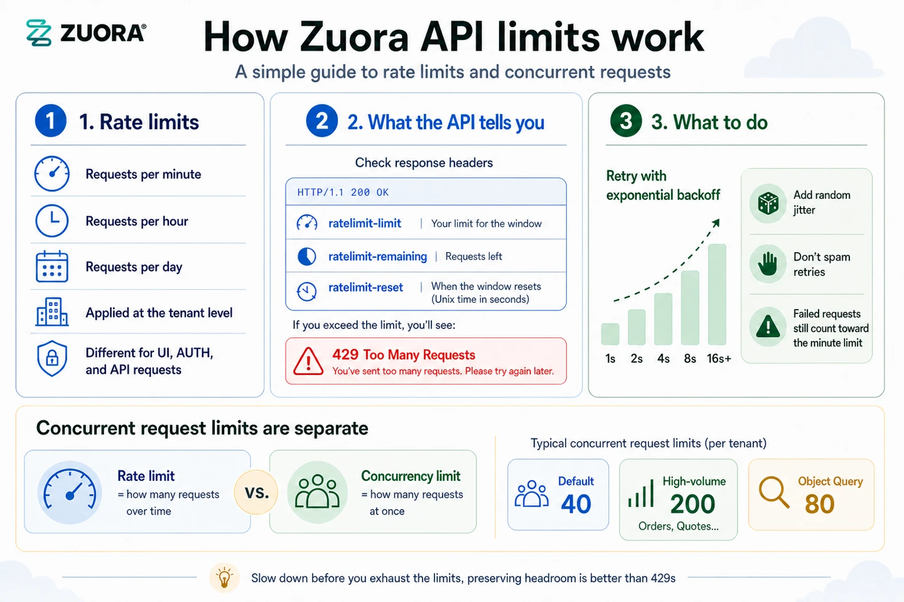

---
seo:
  title: Rate and concurrent request limits - Zuora
  description: Describes the concurrent request limits and rate limits of the Zuora API
  keywords: >-
    concurrent request limits, rate limits, concurrency limiting, rate limiting,
    REST API
markdown:
  toc:
    hide: false
redirects:
  /rest-api/general-concepts/rate-concurrency-limits/: {}
---

# Rate limits

## Why do we have rate limits?

Rate limits are a common practice for APIs, and they are put in place for different reasons:

- **They help protect against abuse or misuse of the API**. For example, a malicious actor could flood the API with requests in an attempt to overload it or cause disruptions in service. By setting rate limits, Zuora can prevent this kind of activity.

- **Rate limits help ensure that everyone has fair access to the API**. If one person or organization makes an excessive number of requests, it could slow down the API for everyone else. By throttling the number of requests that a single user can make, Zuora ensures that the most number of people have an opportunity to use the API without experiencing slowdowns.

- **Rate limits can help Zuora manage the aggregate load on its infrastructure**. If requests to the API increase dramatically, it could tax the servers and cause performance issues. By setting rate limits, Zuora can help maintain a smooth and consistent experience for all users.

See the [Error handling tutorial](/docs/guides/error-handling/) for code examples and guidance on preventing rate limit breaches. The tutorial also outlines best practices for avoiding rate limits and recommended strategies for handling rate limit errors when they occur.




## How do these rate limits work?

Rate limits are measured in three ways: RPM (requests per minute), RPH (requests per hour), and RPD (requests per day).

All requests are classified as one of: UI (UI requests), AUTH (authentication requests) or API (API requests, excluding authentication).

Zuora enforces the following rate limits on each tenant by tenant type:

**Production & Central Sandbox tenants**

| Type | RPM | RPH | RPD |
| --- | --- | --- | --- |
| UI | 20,000 | 1.2M| 14.4M |
| AUTH | 2,000 (100 per IP address) | 67,500 | 810,000 |
| API | 50,000 | 2.25M | 27M |

**Developer Sandbox tenants**

| Type | RPM | RPH | RPD |
| --- | --- | --- | --- |
| UI | 20,000 | 1.2M| 14.4M |
| AUTH | 2,000 (100 per IP address) | 67,500 | 810,000 |
| API | 12,500 | 25,000 | 50,000 |

**API Sandbox tenants**

| Type | RPM | RPH | RPD |
| --- | --- | --- | --- |
| UI | 20,000 | 1.2M| 14.4M |
| AUTH | 2,000 (100 per IP address) | 67,500 | 810,000 |
| API | 2,500 | 5,000 | 10,000 |


We recommend you treat these limits as maximums and avoid generating any unnecessary load. We may reduce limits to prevent abuse, or increase limits to enable high-traffic applications. To request an increased limit, contact <a href="https://support.zuora.com/" target="_blank">Zuora Global Support</a>.

Performance Booster, Performance Booster Elite, and Performance Booster Elite+ are designed to enhance your system's speed and reliability under load, but do not increase rate limits. Rate limits apply as outlined above.


In certain instances, API Sandbox tenants may have higher limits than the limits published on this page. If you are migrating from API Sandbox to Developer Sandbox, we recommend reviewing the Developer Sandbox limits in advance. Note that most API Sandbox customers operate well within Developer Sandbox limits.


In summary:

- Rate limits are imposed at the tenant level, not user level.
- Rate limits vary by the type of request being made.

## Rate limits in headers

In addition to checking these rate limits, you can also view important information about your rate limits such as the maximum number of requests that are permitted before exhausting the rate limit, the remaining number of requests that are permitted before exhausting the rate limit, and the time until the rate limit resets to its initial state.

You can expect to see the following header fields:

| Field | Sample Value | Description |
| ---- | ---- | -------- |
|`ratelimit-limit`| `2250000, 50000;w=60, 2250000;w=3600, 27000000;w=86400`| The maximum request limit for the time window closest to exhaustion plus the maximum number of requests that are permitted before exhausting the rate limit for each window: RPM, RPH, and RPD.|
|`ratelimit-remaining`| `399`| The remaining number of requests that are permitted before exhausting the rate limit. |
|`ratelimit-reset`| `1200` | The time until the rate limit resets to its initial state. |


In the case of the sample values in the preceding table, it means that you can make 399 more requests at most in the next 1,200 seconds. If you instead make 399 requests in the next 600 seconds, when you make the 400th request you will receive an `HTTP 429 - Too Many Requests` response as below:

```
HTTP/1.1 429 - Too Many Requests
Content-Type: application/json
ratelimit-limit : 2250000, 50000;w=60, 2250000;w=3600, 27000000;w=86400
ratelimit-remaining : 0
ratelimit-reset : 600
```

## Retrying with exponential backoff

One easy way to avoid rate limit errors is to automatically retry requests with a random exponential backoff. Retrying with exponential backoff means performing a short sleep when a rate limit error is hit, then retrying the unsuccessful request. If the request is still unsuccessful, the sleep length is increased and the process is repeated. This continues until the request is successful or until a maximum number of retries is reached.

This approach has the following benefits:

- Automatic retries means you can recover from rate limit errors without crashes or missing data

- Exponential backoff means that your first retries can be tried quickly, while still benefiting from longer delays if your first few retries fail

- Adding random jitter to the delay helps retries from all hitting at the same time.

Note that unsuccessful requests contribute to your per-minute limit, so continuously resending a request won’t work.

These rate limits are in addition to, and independent of, [concurrent request limits](#concurrent-request-limits).

## Concurrent request limits

In addition to rate limits, Zuora also has concurrent request limits. Like rate limits, concurrent request limits apply at the tenant level but if the <a href="https://docs.zuora.com/en/zuora-platform/user-management/multi-entity/overview-of-multi-entity" target="_blank">Multi-entity</a> feature is enabled in your tenant, the concurrent API request limits apply at the entity level.

Concurrent request limits are classified as the following concurrency limit types:

| Type | Concurrency Limit|
| ---- | ---- |
| Default | 40 |
| High-volume transactions | 200 |
| Object Query | 80 |


The default request limit applies to all requests, except:

  - The high-volume transactions listed below:

      - [Create an account](/v1-api-reference/api/accounts/post_account)
      - [Create an order](/v1-api-reference/api/orders/post_order)
      - [Preview an order](/v1-api-reference/api/orders/post_previeworder)
      - [Create a subscription](/v1-api-reference/api/subscriptions/post_subscription)
      - [Preview a subscription](/v1-api-reference/api/subscriptions/post_previewsubscription)
      - [Update a subscription](/v1-api-reference/api/subscriptions/put_subscription)
      - [Cancel a subscription](/v1-api-reference/api/subscriptions/put_cancelsubscription)
      - [Renew a subscription](/v1-api-reference/api/subscriptions/put_renewsubscription)
      - [Generate an RSA signature](/v1-api-reference/api/rsa-signatures/post_rsasignatures)
      - [Payment Pages 2.0](https://docs.zuora.com?resourceId=payments-integrate-payment-pages-2.0) (`PublicHostedPageLite.do`)

  - The [Create an OAuth token](/v1-api-reference/api/oauth/createtoken) request, which is unlimited and not bound by the concurrency limit.

  - The [Object Query](/v1-api-reference/api/object-queries/) and [Quickstart API](/other-api/quickstart-api/) requests, which are calculated towards the Object Query concurrency limit.


## Concurrent request limits in headers

The following response headers are available to all operations that contain `/v1` or `/object-query` in the endpoint:
- `Concurrency-Limit-Type`: the type of concurrency limit, which can be `Default`, `High-volume transactions`, or `Object Query`. This type is preset at the operation level.
- `Concurrency-Limit-Limit`: the total number of permitted concurrent requests.
- `Concurrency-Limit-Remaining`: the remaining number of permitted concurrent requests.

These headers provide visibility into the total and remaining concurrency limits, thereby reducing the API failure rate associated with reaching these limits.

**Notes**:
- The `Concurrency-Limit-Remaining` header parameter is fetched every second from the Zuora server. In high-throughput scenarios, you might see a sudden drop in this value. It is recommended that you do not consume the entire limit to prevent throttling.
- Depending on the encountered issue, these headers are not always returned in the 500 response.


