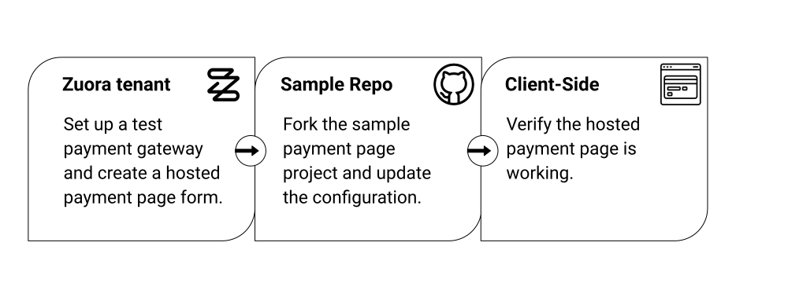
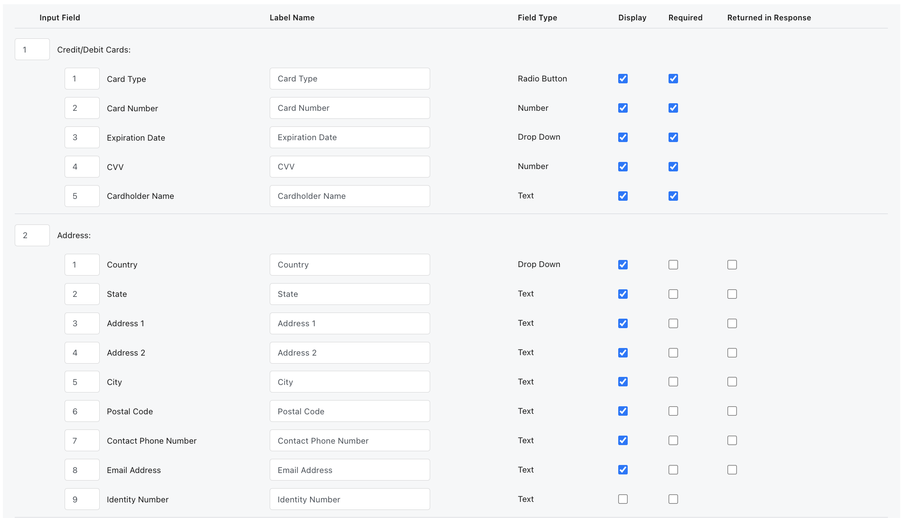
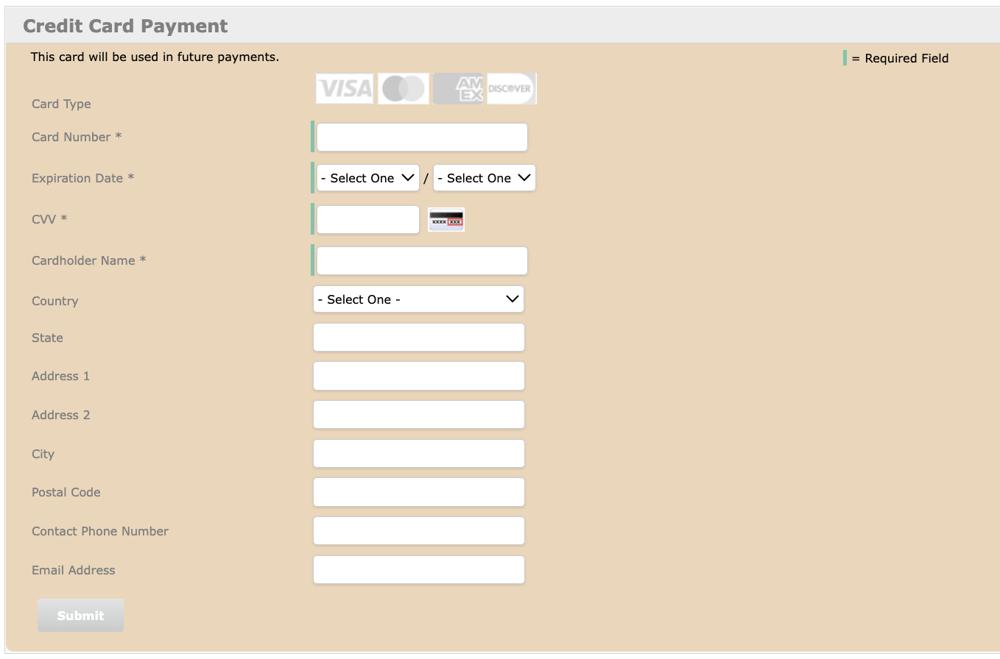
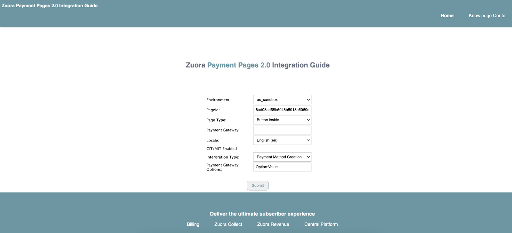
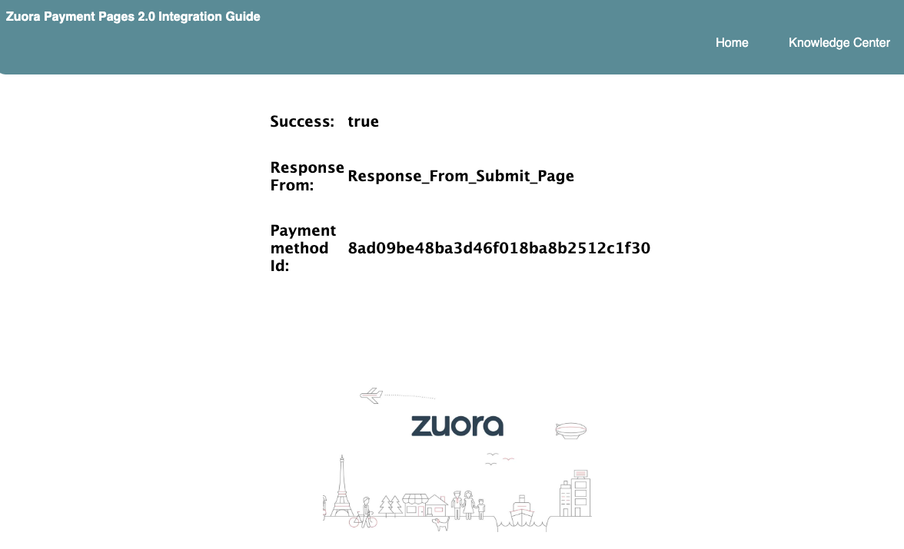

This tutorial provides a step-by-step guide to setting up a payment page hosted in Zuora. You will implement a payment method creation flow to collect your customers' payment method information and store it in Zuora in a PCI-compliant way. Checkout flow is not covered in this tutorial.


In this tutorial, you will need to complete tasks illustrated in the following diagram:





With Zuora's ready-to-use web server, you can easily get your payment page up and running without setting up a server from scratch.


## Scenario

When your customers sign up for your website, you want to collect their credit card information, which will be used for your customers’ one-time or recurring payments in the future. You want to add a PCI-compliant page for collecting credit card information to the signup experience. Here is your plan for the hosted payment page:


* Accepted payment method: Credit Card
* Information to be collected:
    * Card type
    * Card number
    * Expiration date
    * CVV (Card Verification Value)
    * Card holder name
    * Card holder address
* Look and feel: embedded in the page
* Security requirements:
    * Limit the number of times a hosted payment page can be submitted from the same IP address within a time range.
    * Limit the number of times a hosted payment page can be submitted before page submission is blocked.
    * Check whether the required input fields are valid.

You will use Zuora’s <a href="https://docs.zuora.com?resourceId=payments-paymentpage2.0-overview" target="_blank">Payment Pages 2.0</a> solution to embed an iFrame form into the page. The embedded form contains an internal submit button and the form submission will be handled by Zuora.


## Prerequisites


- Ensure that you have installed Node 16 or higher. To download Node, check <a href="https://nodejs.org/en/download" target="_blank">Download Node</a>.
- You have an active GitHub account.
- You have a sandbox environment in Zuora.
- You must use a user with the [API Write Access permission](https://docs.zuora.com?resourceId=platform-user-role-for-platform) to access the sandbox environment.


## Implementation steps

In your sandbox environment, complete the following tasks. We will use the **API sandbox environment of US Cloud Data Center 2** as the sample environment in this tutorial.

For a complete list of URLs for Zuora environments, see <a href="https://docs.zuora.com?resourceId=zuora-data-centers" target="_blank">Zuora Data Centers</a>.

### Step 1 Set up a test gateway instance

If you already have a Test Gateway instance, skip this step. If you have NOT set up a Test Gateway instance on your tenant, complete the following steps.


1. Click your username in the upper right and navigate to **Settings > Payments > Setup Payment Gateway**.
2. On the **Configure Gateway Instance** tab, select **Test Gateway** from the **Gateway Type** drop-down list at the bottom of the page.
3. Click **Create Gateway**.
4. On the New Gateway page, enter a name for your gateway instance in the **Name** field, and keep the default value for all other fields. If you want to learn more about the configuration fields, see [Set up payment gateways](https://docs.zuora.com?resourceId=payments-configure-gateway-instance).
5. Click **Save Gateway Information**.


### Step 2 Create a hosted payment page


#### Create and configure a hosted payment page


1. In Zuora, click your username in the upper right and navigate to **Settings >** **Payments > Setup Payment Page and Payment Link**.
2. On the **Payment Pages** tab, click **Get HPM 2.0 Key** in the **Security Keys** section. A file containing a public key will be downloaded. You will need to pass it as one of the parameters when you load the hosted payment page in a later step.
3. On the **Payment Pages** tab, you can configure the IP-Based Submission Rate Limiting feature in the **Rate Limiting Configuration** section. Keep **IP Whitelist** empty and keep the default values for other fields. You can find the default value in the tooltip.

   In this tutorial, **we will NOT enable the following tenant-level settings**. If you want to know about these settings, see [Tenant-level settings for Payment Pages 2.0](https://docs.zuora.com?resourceId=payments-paymentpage2.0-configuration):

   * Google reCAPTCHA Enterprise Configuration
   * Raw Gateway Info Configuration
   * Advanced Configuration
       * Validate Client-Side HPM Parameters
       * Allow Subdomain Callback For Hosted Pages
4. At the bottom of the page, select **Credit Card** from the **Type** list, and then click **Create New Hosted Page**.
5. Configure the page-level settings for the hosted payment page. To complete this tutorial, use the value suggested in the **Value** column in the following table. To learn more about the settings, see [Configure Credit Card Type Payment Pages 2.0](https://docs.zuora.com?resourceId=payments-creditcard-paymentpage2.0-configuration).

<table> <thead> <tr> <th>Section</th> <th>Setting</th> <th>Value</th> </tr> </thead> <tbody> <tr> <td rowspan="3">Basic Information</td> <td>Page Name</td> <td>Enter <code>My First Payment Page</code></td> </tr> <tr> <td>Hosted Domain</td> <td>Enter <code>http://localhost:3000</code></td> </tr> <tr> <td>Callback Path</td> <td>Enter <code>/payment_page/callback</code></td> </tr> <tr> <td rowspan="3">Security Information</td> <td>Google reCAPTCHA</td> <td rowspan="3">Keep the default values for all settings. <p>Token Expiration will be enabled. Google reCAPTCHA or 3D Secure will not be enabled.</p> </td> </tr> <tr> <td>Token Expiration</td> </tr> <tr> <td>3D Secure</td> </tr> <tr> <td>Payment Gateway</td> <td>Default Payment Gateway</td> <td>Select the test gateway instance.</td> </tr> <tr> <td rowspan="7">Page Configuration</td> <td>Page Title</td> <td>Enter <code>Credit Card Payment</code>. <p>Keep <strong>Display</strong> selected.</p> </td> </tr> <tr> <td>Page Description</td> <td>Enter <code>This card will be used in future payments.</code> <p>Keep <strong>Display</strong> selected.</p> </td> </tr> <tr> <td>Page Fields</td> <td>Keep the default configuration. <p>The screenshot after this table shows an example.</p> </td> </tr> <tr> <td>Submit Button</td> <td>Enter <code>Submit</code>.</td> </tr> <tr> <td>Client-Side Validation</td> <td>Keep <strong>Enable client-side validation</strong> selected. <p>Keep the default value for error messages.</p> </td> </tr> <tr> <td>Credit Card Type Detection</td> <td>Keep <strong>Enable automatic credit card type detection</strong> selected.</td> </tr> <tr> <td>CSS</td> <td>Keep the default CSS.</td> </tr> </tbody> </table>



6. Click **Generate and Save Page**.
7. A message will appear to prompt you that Google reCAPTCHA or Token Expiration security settings are enabled. Scroll down to the message dialog and click **OK**.


#### Preview your hosted payment page

After you save your hosted payment page, the Preview Hosted Payment Method Page page is displayed. In the **Page Preview** section, use the following default configuration and preview your page:

* **Form Type**: Inline
* **Locale**: English (en)

Your page will look like this:


To retrieve the hosted page URL that will be passed as a parameter when you load the hosted payment page, check the information in the **Implementation Details** section and note down **Hosted Page URL**.

For more information, see [Preview the Payment Page](https://docs.zuora.com?resourceId=payments-paymentpage2.0-preview).


#### Retrieve page ID

You have now created a hosted payment page. Complete the following steps to retrieve the page ID. You will need to pass the page ID as one of the parameters when you load the hosted payment page in a later step.


1. If you are on the Preview Hosted Payment Method Page page, click **back to Hosted Pages List** in the upper left of the page to navigate back to the **Payment Pages** tab.
2. In the **Page List** section, find the payment page (**My First Payment Page**) you just created.
3. In the **Actions** column, click **Show Page Id**.
4. Note down the page ID.


#### (Optional) Update the CSS of your hosted payment page

Assuming you want to change the background color of the hosted payment page and want the legend for Required Field to be displayed in the upper right of the page, complete the following steps to update the CSS of your hosted payment page.


1. Navigate to the **Payment Pages** tab > **Page List** section.
2. Find **My First Payment Page** and click **Edit**.
3. In the **CSS** field, make the following changes:
   * In the `.form` CSS selector, add the following declaration:

        ```css
        background-color: #eed5b7;
        ```

       Here is an example:

        ```css
        .form {
          padding: 20px 16px;
          margin: 0 auto;
          background-color:#eed5b7;
        }
        ```


   * In the `.required-desc` selector, add the following declarations:

        ```css
        position:absolute !important;
        top:5% !important;
        left: 70% !important;

        ```


        Here is an example:

         ```css
            .required-desc {
                  width: 24%;
                  float: right;
                  margin-top: 11px;
                  border-left: 4px solid #6EC5AB;
                  vertical-align: middle;
                  min-width:120px;
                  position:absolute !important;
                  top:5% !important;
                  left: 70% !important;
               }

         ```

4. Click **Generate and Save Page**.

Your page will look like the following screenshot:





For more information about designing CSS for hosted payment pages, see [Design Payment Pages CSS](https://docs.zuora.com?resourceId=payments-paymentpages-css).


### Step 3 Get the payment page up and running

Now you need a web server to host this created payment page. To quickly get the payment page up and running, you can use Zuora's official [Sample Payment Page](https://github.com/zuora/payment-page-samples).


#### Fork the sample payment page

Take the following steps to create a new fork:


1. Log into your GitHub account.
2. On the [payment-page-samples](https://github.com/zuora/payment-page-samples) repository page, click **Fork**.
3. On the Create a new fork page, select the owner of the forked repository and specify the repository name. Leave other settings unchanged.
4. Click **Create fork**. Then your fork is created.
5. Clone the forked repository to your local environment.


#### Update configuration files

In the cloned `payment-page-samples` repository, the `/conf` folder stores multiple configuration files across different environments and prepopulated values for form fields.

Update the configuration for the `us_sandbox` block in the `/conf/config.json` file as below:


<table> <thead> <tr> <th>Field</th> <th>Description</th> <th>Value</th> </tr> </thead> <tbody> <tr> <td>username</td> <td>It should be the username for a user with the <strong>API Write Access</strong> permission. It will be used to call the Zuora REST API. <p>You can also choose to leave it blank and specify <code>oauth_token</code> that you can get by calling the (Create an OAuth token)[/v1-api-reference/api/oauth/createtoken] API operation.</p> </td> <td><code>{your_username}</code></td> </tr> <tr> <td>password</td> <td>It should be the password for a user with the <strong>API Write Access</strong> permission. It will be used to call the Zuora REST API. <p>You can also choose to leave it blank and specify <code>oauth_token</code> that you can get by calling the (Create an OAuth token)[/api-references/api/operation/createToken/] API operation.</p> </td> <td><code>{your_password}</code></td> </tr> <tr> <td>oauth_token</td> <td>The OAuth token generated by calling the (Create an OAuth token)[/api-references/api/operation/createToken/] API operation. <p>If you specify this token, you do not need to specify the <code>username</code> and <code>password</code> fields.</p> </td> <td><code>{Oauth_token}</code></td> </tr> <tr> <td>rsa_signature</td> <td>The endpoint for the (Generate an RSA signature)[/api-references/api/operation/POST_RSASignatures/] API operation.</td> <td><code>/v1/rsa-signatures</code></td> </tr> <tr> <td>zuora_base_url</td> <td>Base URL for the Zuora's RSA Signature API. Update it to the corresponding base URL if you are not using a US 2 API Sandbox tenant.</td> <td><code>https://rest.apisandbox.zuora.com</code> (for the US 2 Sandbox tenant)</td> </tr> <tr> <td>payment_page_url</td> <td>Zuora's Payment Page URL.</td> <td><code>https://apisandbox.zuora.com/apps/PublicHostedPageLite.do</code> (for the US 2 Sandbox tenant)</td> </tr> <tr> <td>pageId</td> <td>ID of the Payment Page you configured in your tenant. You can get this ID by navigating to <strong>Settings &gt; Payments &gt; Setup Payment Page and Payment Link &gt; Page List &gt; Show Page Id</strong> in your US Cloud 2 API Sandbox tenant.</td> <td><code>{pageId_from_your_tenant}</code></td> </tr> <tr> <td>accountId</td> <td>(Optional) The ID of the customer account present on the Zuora side. If any transaction is performed after a payment method is created, the transaction can be associated with an account through accountId.</td> <td>Specify the <code>{account_id}</code> of an account with which the payment method will be associated.</td> </tr> <tr> <td>publicKey</td> <td>The public key that you downloaded from your tenant.</td> <td><code>{public_key_from_tenant}</code></td> </tr> </tbody> </table>


#### Clear the sample prepopulated fields

Because this payment page is only used to collect credit card payment method information, you do not need to preload any values for the payment page form fields.

Now you need to clear the sample prepopulated values for the `creditCard` block configured in `/conf/prepopulate.json`. You can also choose to clear the rest of the prepopulated values for other types of payment methods or leave them unchanged.

See the following `prepopulate.json` as an example:


```json
{
    "creditCard": {
        "creditCardAddress1": "",
        "creditCardAddress2": "",
        "creditCardCountry": "",
        "creditCardHolderName": "",
        "creditCardNumber": "",
        "creditCardExpirationYear": "",
        "creditCardExpirationMonth": ""
    }
 }
```


#### Start the server

In the terminal, navigate to the cloned `payment-page-samples` folder, then run the following command:


```bash
$ npm install
```


After the `package-lock.json` and the `node_modules` folder are successfully installed, run the following command to start the server:


```bash
$ npm start
```


If no error occurs, open [http://localhost:3000](http://localhost:3000) in the browser, then you should see the following page:



This page is the start page where you can configure which Payment Page will be shown and which transaction type you want to perform using this Payment Page.


#### Verify that the Payment Page is working

On the Zuora Payment Pages 2.0 Integration Guide page, take the following steps to start testing the Payment Page:


1. Verify if the payment page can be successfully rendered:

   a. Configure the form as below:

   <table> <thead> <tr> <th>Form Field</th> <th>Value</th> </tr> </thead> <tbody> <tr> <td>Environment</td> <td>Select <strong>us_sandbox</strong>.</td> </tr> <tr> <td>PageId</td> <td>PageId is auto-populated from <code>/conf/config.json</code>.</td> </tr> <tr> <td>Page Type</td> <td>Select <strong>Button inside</strong></td> </tr> <tr> <td>Payment Gateway</td> <td>Leave it blank.<br /> If you specify this field, it will be used to override the default test gateway configured in the payment page form.</td> </tr> <tr> <td>Locale</td> <td>Leave the default selection unchanged.</td> </tr> <tr> <td>CIT/MIT Enabled</td> <td>Leave it unselected</td> </tr> <tr> <td>Integration Type</td> <td>Select <strong>Payment Method Creation</strong></td> </tr> <tr> <td>Payment Gateway Options</td> <td>Leave it unchanged</td> </tr> </tbody> </table>


    b. Click **Submit**. If the Payment Page is loaded, you can proceed to the next step; otherwise, you should troubleshoot based on the error message. For more information, see [Troubleshooting](#troubleshooting) for more information.

2. Verify if the payment page is working as expected:

   a. Specify the following required fields in the Payment Page:

   <table> <thead> <tr> <th>Field</th> <th>Value</th> </tr> </thead> <tbody> <tr> <td>Card Number</td> <td>4111111111111111</td> </tr> <tr> <td>Expiration Date</td> <td>01/2034</td> </tr> <tr> <td>CVV</td> <td>737</td> </tr> <tr> <td>Cardholder Name</td> <td>Amy Lawrence</td> </tr> </tbody> </table>

   You can also specify values in invalid formats to verify if your customized error message takes effect. For example, setting the expiration date to a date in the past.

   b. Click **Submit**. You should receive the following response.

   

   c. Verify that the payment method is successfully created through the UI.

       1. Go back to the Zuora UI of the US 2 Sandbox tenant.
       2. Click **Payments > Payment Methods**. The customer account list with the payment method information is displayed.
       3. Locate the payment method you just created. It is usually displayed at the top of the payment method list.

           * If you have specified the `accountId` value, you can locate the created payment method by locating the associated account.
           * If you did not specify `accountId`, you can locate the created payment method by cross-comparing the last 4 digits of the **Card Number** value and the **Last Transaction** value.

3. (Optional) You can repeat Step 1 to 2.b and specify values in invalid formats to verify if your customized error message takes effect. For example, setting the expiration date to a date in the past.


Now your sample payment page is all set. You can change the configuration to see how the Payment Page is rendered in different ways, such as presenting a payment page using the overlay format.


## Troubleshooting

The following table describes the most frequently encountered issues when integrating with your websites:


<table> <thead> <tr> <th>Issue</th> <th>Possible root causes</th> <th>Solution</th> </tr> </thead> <tbody> <tr> <td rowspan="4">The payment page is not loaded to the intended webpage.</td> <td>The specified domain or port for the payment page configuration does not match the domain or port on which your server is running.</td> <td>In the Zuora UI, check the value specified in the <strong>Hosted Domain</strong> field for the payment page and ensure that the domain and port match your website's domain and port.</td> </tr> <tr> <td>The RSA signature or token is not generated successfully or not passed into the payment page properly.</td> <td>Check your code that calls the (Generate an RSA signature)[/api-references/api/operation/POST_RSASignatures/] operation and ensure that the request succeeds. For more instructions, see <a href="https://docs.zuora.com?resourceId=payments-paymentpage2.0-digitalsignature-generation">Generate and manage the Digital Signature and Token for Payment Pages 2.0</a>.</td> </tr> <tr> <td>The configuration in the <code>/conf/config.json</code> has conflicts. For example, the <code>pageId</code> does not exist for the specified environment.</td> <td>Check the configuration file to make sure that the payment page settings are correct.</td> </tr> <tr> <td>Zuora Javascript library is not imported to the intended web page.</td> <td>Check the client-side web page code to ensure that the Zuora JS library is imported into your web page.</td> </tr> <tr> <td>After submitting the payment page form with the required fields specified, the payment method is not created successfully or the payment transaction failed.</td> <td>Not all client parameters required by the gateway are submitted to the server.</td> <td>Check if all necessary client parameters are provided in the <code>loadPaymentPages</code> function. <p>For a full list of client parameters, see <a href="https://docs.zuora.com?resourceId=payments-clientparameters-for-paymentpage2.0">Client Parameters for Payment Pages 2.0</a>.</p> </td> </tr> <tr> <td>After entering illegal values into the form fields, the custom error handling does not take effect.</td> <td> <ul> <li>The error handling functions are not working as expected.</li> <li>The errorMessageCallback function is implemented but you used <code>Z.render()</code> instead of <code>Z.renderWithErrorHandler()</code>.</li> </ul> </td> <td>Check the <code>callback</code> and <code>errorMessageCallback</code> functions to ensure that they can work. For more instructions, see the following pages: <ul> <li><a href="https://docs.zuora.com?resourceId=payments-errorhandling-for-paymentpages2.0">Error Handling for Payment Pages 2.0</a></li> <li><a href="https://docs.zuora.com?resourceId=payments-errormessage-paymentpages2.0-customization">Customize Error Messages for Payment Pages 2.0</a></li> </ul> </td> </tr> <tr> <td>Predefined credit card values are not prepopulated to the payment page.</td> <td> <ul> <li>The file that contains prepopulated values is invalid.</li> <li>The prepopulated field values are handled incorrectly.</li> </ul> </td> <td> <ul> <li>Check the file that stores prepopulated values and ensure that this file is valid.</li> <li>Ensure that the prepopulating logic is working as intended.</li> </ul> </td> </tr> <tr> <td>The payment page is not displayed in the correct place.</td> <td>The <code>&lt;div id="zuora_payment" className="container container-center"&gt;&lt;/div&gt;</code> is not added to the correct place.</td> <td>Check the client-side webpage code and ensure that <code>&lt;div id="zuora_payment" className="container container-center"&gt;&lt;/div&gt;</code> is added to the intended place.</td> </tr> </tbody> </table>
