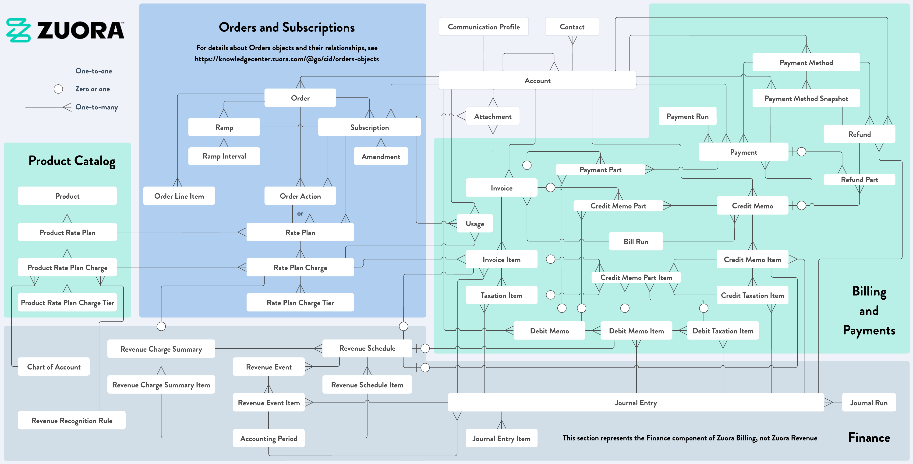

---
seo:
  title: Zuora Object Model - Zuora
  description: Describes the Zuora object model
  keywords: object model, data model
markdown:
  toc:
    hide: false
redirects:
  /rest-api/general-concepts/object-model/: {}
---

# Zuora object model

## Overview

The following diagram is a high-level view of how key business objects are related to one another within Zuora Billing and Payments.

Click the diagram to open it in a new tab and zoom in. For more information about the different sections, see
<a href="https://docs.zuora.com?resourceId=zuora-business-object-model" target="_blank">Zuora business object model</a>.

This diagram is intended to provide a conceptual understanding; it does not illustrate a specific way to integrate with Zuora.

The diagram includes the Orders feature and the Invoice Settlement feature.

Each tenant has a tenant-specific object model diagram that visualizes the relationships between objects and the details on each object, including standard objects and fields, and custom objects and fields. To view this diagram, navigate to **Extension Studio** > **Object Manager** in the left navigation menu in the Zuora UI, and then click the **Schema Visualizer** tab. See <a href="https://docs.zuora.com?resourceId=platform-schema-visualizer-overview" target="_blank">Schema Visualizer</a> for more information.

The Zuora Billing Business Object Model is the framework underpinning our **Zuora Billing** and **Payments** features. Our object model enables businesses to automate complex billing scenarios at scale while maintaining transparency and compliance with financial regulations.

## Key concepts

Our model’s core revolves around Accounts, Subscriptions, Orders, Invoices, and Payments.

### Accounts, Subscriptions, and Orders

- A **Billing Account** (**Account** for short) represents a billing entity, a customer you will invoice for your products and services. The account holds related billing and payment documents, the billing contacts, and their preferred billing day and payment methods such as credit cards, eWallet, or bank account information. The account captures one or more customer orders.

- An **Order** captures the products and services purchased by an account. A single order records the purchase of physical goods, digital services, or a combination of both. Purchases of digital services result in the creation of one or more **Subscriptions**.

- A **Subscription** captures the billing contract for products or services. The Subscription object defines not only the services or products a customer has signed up for, but also how often they will be billed for. Other contract details such as the contract length are also specified, along with agreed pricing and payment terms.

You customers hopefully have a long productive relationship with you where they might augment their original order with additions, removals, renewals, and other possible order actions. We refer to all of these as the **Subscription Lifecycle**. So orders can create or modify subscriptions belonging to a billing account for one-time or recurring goods or services, and can also create and modify order line items for one-time fees or physical goods.

### Invoices and Payments

Orders and Subscriptions generate **Invoices** that are paid for using **Payments**. Invoices are generated based on order line items or subscription rate plan charges along with configured billing rules. More details on charges are provided in the [Product catalog](#product-catalog) section.

- Each **Invoice** contains **Invoice Items**, with every invoice item being sourced from a subscription charge or an order line item.

- **Payment** record transactions through payment methods like credit cards, and are applied to billing documents like invoices or billing document items like invoice items. With Zuora Billing, you can create and track credit and debit memos as well as refunds, which ensures financial reporting accuracy.

Zuora provides extensive billing and payment automation support. **Bill Runs** generates invoices, while **Payment Runs** use the account’s **Payment Methods** to automatically capture payments for those new invoices. These billing and payment runs can generate invoices and payments at a rate that exceeds tens of thousands each hour.

### Product catalog

The **Product Catalog** defines how businesses configure and manage their offerings within the billing system.

- At the core are **Products**, which represent goods or services available for sale. Each product contains one or more product rate plans.

- Each **Product Rate Plan** defines the pricing structure. For example, discounted annual plans with monthly billing options for the same product or service. To accomplish this flexibility, each product rate plan contains one or more product rate plan charges.

- Each **Product Rate Plan Charge** (**Charge** for short) specifies the actual pricing details, including:
  - **charge type**: one time, recurring, or usage,
  - **charge models**: For example, flat fee, per unit, or volume pricing, and more. See <a href="https://docs.zuora.com?resourceId=billing-charge-models-configure-any-pricing" target="_blank">Charge models</a> for all available charge models in Zuora.

  Each charge also captures the default billing frequency and price points.

- The **Product Rate Plan Charge Tier** object for each charge uses **Volume** or **Tiered** pricing. Each Tier object captures one row of the price table for the parent charge.

This **Products** - **Plans** - **Charges** - **Tiers** hierarchical structure allows for flexible pricing strategies while maintaining organized and reusable components that can be combined into various product offerings. The catalog integrates seamlessly with the Orders and Billing Object Models.

An order can simply identify the product rate plan that your customer has asked for. Zuora then copies all product rate plan charge details for that customer and stores them under the billing account as a collection of Rate Plan, Rate Plan Charge, and Rate Plan Charge Tier objects. When adding any product rate plan to an order, you can optionally override the default values specified in the charges and tiers.
In most scenarios, customers would request to set a different quantity. You can also choose to adjust the price paid for the specifid quantity, only for this order or account.
While quantity and pricing overrides are most common, many other customization options are supported.

## Additional resources

- For more information about the Orders objects, see <a href="https://docs.zuora.com?resourceId=billing-orders-object-model" target="_blank">Orders object model</a>.

- For more information about the Invoice Settlement objects, see <a href="https://docs.zuora.com?resourceId=billing-invoice-settlement-object-model" target="_blank">Invoice Settlement object model</a>.

- If your organization does not use either of these features, see
<a href="https://docs.zuora.com?resourceId=zuora-business-object-model-prior-to-orders-and-invoice-settlement" target="_blank">Zuora Billing business object model prior to Orders and Invoice Settlement</a> for an alternative diagram.
