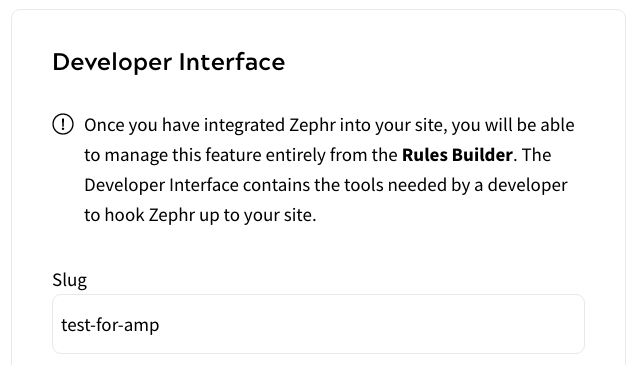
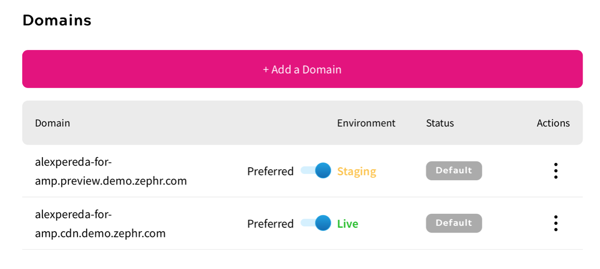
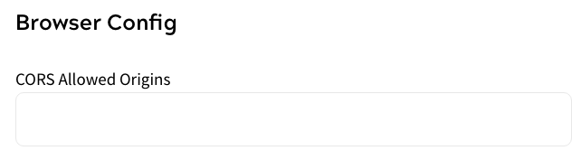
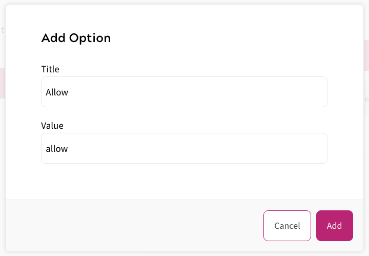
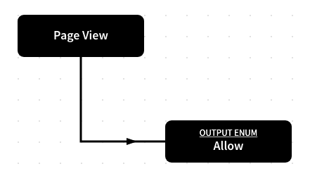
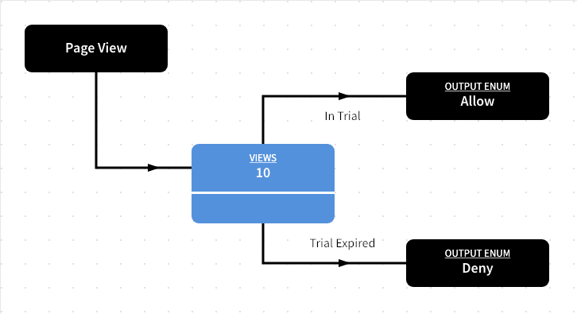

---
seo:
  title: Integrating with AMP Web Component Frameworks
---

# Integrating with AMP Web Component Frameworks

This guide details the steps for teams to integrate Zephr SDK Features with AMP Web Component Framework sites.

Full documentation for AMP is available [here](https://amp.dev/).

## Before Coding AMP

Before starting, you will need to locate your Zephr Domain and Slug within the Zephr Admin Console, and then add your site URL to the CORS origins.

### Slug

Your slug can be found within the Developer Interface for the relevant SDK Feature.

Navigate to Products > Features and then select the Feature from the list. Locate the Developer Interface section, open the Developer Interface and find the Slug section.

If you are creating a new Feature, navigate to Products > Features and click Add A Feature. Give your Feature a Title, and select SDK in the Type of Integration section, then click Continue. Your Developer Interface will open on the next screen.



For this example, we are using the slug `test-for-amp`.

### Domain

Your domain can be located by navigating to Delivery > Sites within your Zephr Admin Console, then clicking into the relevant site.



In this example, we are using `alexpereda-for-amp.cdn.demo.zephr.com`.

### CORS Allowed Origins

Whilst locating your Domain, scroll down to the Browser Config section and add your site URL.



Remember to click Save once added.

## AMP Access

If you are using your own CDN, we will be using the AMP component called AMP Access, which provides an AMP paywall and subscription support. Specific documentation for this component can be found [here](https://amp.dev/documentation/components/amp-access/).

To use this component, the following script must be added to the HEAD of the document:

`<script async custom-element="amp-access" src="https://cdn.ampproject.org/v0/amp-access-0.1.js"></script>`

AMP access will use the following script:

```javascript
<script id="amp-access" type="application/json">
    {
        "property": value,
        ...
    }
</script>
```

The specific property we need to use is authorization, which should be done using the following format, where the Domain and Slug are the values covered at the beginning of this document, and the Source Reader ID is your AMP User ID:

`“authorization” : “_<Your domain>_/zephr/decision-engine?sdkFeatureSlug=<Slug Name>&session=<Source_Reader_Id>`

### Example

```javascript
<script id="amp-access" type="application/json">
{
    “authorization” : “https://alexpereda-for-amp.cdn.demo.zephr.com/zephr/decision-engine?sdkFeatureSlug=test-for-amp&session=READER\_ID",
        "noPingback": true
}
```

This script will call the decision engine in Zephr to route the visitor to the relevant journey, as described in your Zephr Features.

### Zephr Features

Once you have integrated Zephr into your site, you will be able to manage this Feature entirely through the Zephr Admin Console interface.

Most of the entitlement decisions within Zephr will be handled through SDK scripted rules. The Developer Interface contains the tools needed by a developer to hook Zephr up to your site. For more information on set up, read our [SDK Feature Rules guide](https://docs.zuora.com?resourceId=zephr-sdk-features "SDK Features").

As part of this example, within the developer interface, we will create a feature with two enum options: Allow and Deny.

Return to your Feature and open the Developer Interface.

Under Output, select the Enum type, then click Add Option.

Enter a Title and Value for Allow, then click Add. Repeat the process for Deny.



When complete, click Update & Lock.

Now, on your Rules Canvas, you will see an Output option. Under this, you will see the options for Allow and Deny that you have just created.

Drag these outputs onto your Rule Canvas and created the desired journey.



This rule will return the word `“allow”` to the AMP-Access component within your HTML code, using the following syntax: `<section amp-access=“outputValue = ‘allow’”>` where allow is the enum from the Zephr rule builder.

This is effectively granting permission for the user to go ahead to the next step of their journey. For example:

```html
</head>
<body>
    <h1> Hello World, I am AMP compliant</h1>
    <section amp-access="outputValue = 'allow'">
    You can access the subscription </section>
    <section amp-access="outputValue = 'deny'"?
        You don't have access. </section>
</body>
```

Once this has been achieved, evolve your journey into a more advanced use case like the example below, in which we are providing a Trial of 10 article views before the paywall is presented:



For more information on integrating with AMP, get in touch with your Zephr Technical Consultant, or email [support@zuora.com](mailto:support@zuora.com "support@zuora.com").