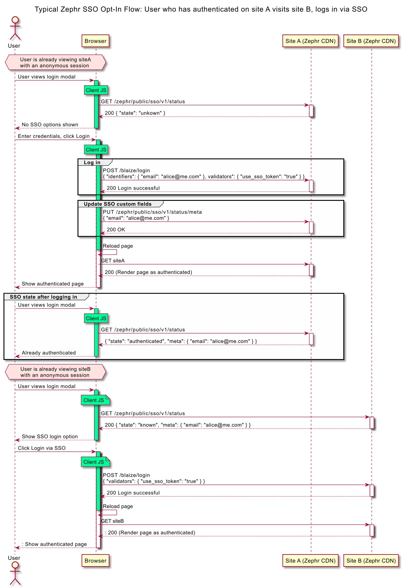

---
seo:
  title: Single Sign-On For Zephr Sites
---

# Single Sign-On For Zephr sites

The following information explains how you would configure single sign-on across Zephr-run sites when using the Zephr Identity Module.

Using single sign-on, after signing-on to Site A, a user can use that sign-on to receive a registered session for Site B (and C, D, etc), when they visit the respective site. This is done through the use of an authentication domain, for example, `<org-name>.auth.zephr.com`.

This configuration requires input from Zephr Support. If you would like help configuring single sign-on, please email [support@zuora.com](mailto:support@zuora.com "support@zuora.com").

## How Single Sign-On Work in Zephr

Sessions on different sites on the same device (browser) are linked, in the Zephr backend, to a single SSO token. This linking is achieved by redirecting the user to the same auth domain from different sites.

When visiting the auth domain a cookie is used to establish the SSO token to use. This token is then linked to a One-Time-Token (OTT) that is set when redirecting back to the original site. Using the OTT ensures that the SSO token cannot be linked without visiting the auth domain first and cannot be reused.

## Configuring Single Sign-On

To enable single sign-on, navigate to Identity > Settings then scroll to the Single Sign-On (SSO) menu.

Here you will have a few options:

*   ****Auto Login**** means a sign-on to one site will automatically sign users into all sites.
*   ****Opt In**** means users will not be automatically signed in but can choose to use an existing sign-on when they sign on to other sites.
*   ****Disabled**** means a user signing on to a site will only sign on to that site.

Once you have selected your configuration option, click Save.

When using SSO in Auto Login mode there is nothing to change when integrating with Zephr. Users will sign on as usual and simply be signed on automatically when visiting other sites.

When using SSO in Opt In mode the user will not be signed-on automatically when visiting other sites. However, the login endpoint can be called in such a way that the user can be signed on without any additional data capture.

To facilitate a user experience that is transparent and informative, integrations can call additional endpoints to store and retrieve information that is linked to an SSO token. In this way, users can be shown appropriate prompts so that they can understand how their sessions are linked across sites.

## Single Sign-On Sequence Diagram

