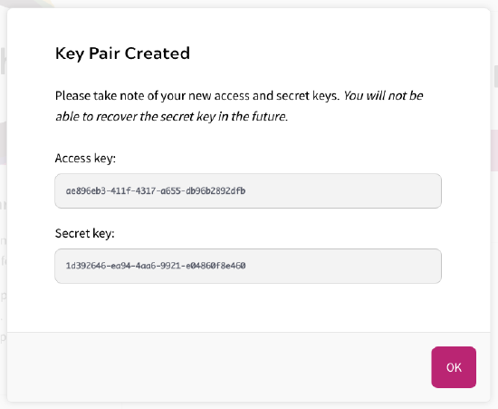
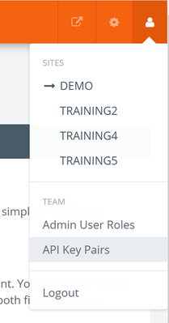
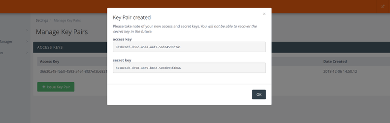

---
seo:
  title: HMAC Request Signing and Key Pair
---

# HMAC request signing and key pair

The Zephr Admin API is secured using key pair authentication. Once a key pair has been created against an Admin User, a request can be signed using an HMAC algorithm in order to allow the request to be executed with the role and identity of the Admin User who owns the keypair.

> NOTE: Because Key Pairs are user-specific, we recommend you create a generic admin user within your Zephr Console – for example `team@<yourcompany>.com` – and create relevant Key Pairs within this user. This means that you will not lose key pairs if a user’s access is removed.

## Creating a Keypair

### In Zephr

Navigate to the Admin User Settings in the top right corner, and click Key Pairs.

Here you will see a list of the available Key Pairs for your admin user.

To create a key pair, click Issue Key Pair.




A modal will open showing your Access Key and Secret Key. Take note of these, as you will not be able to recover the secret key in the future.

Once you have saved these details, click Ok.

### In Zephr Classic

Key pairs are managed under the user icon in the top right of the Zephr admin dashboard:



Click “Issue keypair” and take note of the secret key.

You will not be able to retrieve the secret key after it is initially displayed.



### Managing Key Pairs

Keypairs created in the admin console allow an integration service to act on behalf of the user who generates them.

You can add notes to the key pair from the context menu in the list of key pairs.

You can also create keypairs via the REST API, if required:

`POST /v3/admin/users/{user\_id}/keypairs`

Note that no body is required in this request.

The response will be:

```
{   
  "access\_key": 
  "access key...",   "secret\_key": "secret key...",   
  "message": "Keypair created: you will not be able to recover the secret, so take note of it" 
}
```

The secret key can never be recovered so it is important to record the payload from this request and store it securely.

## Signing a request

To execute a secure request you must provide an Authorization header with a request signature:

```
GET /v3/users 
Authorization: ZEPHR-HMAC-{{ALGORITHM}} {{ACCESS\_KEY}}:{{TIMESTAMP}}:{{NONCE}}:{{HASH}}
```

Where:

*   ALGORITHM is “SHA256”
*   ACCESS\_KEY is the access key from the keypair
*   TIMESTAMP is the current number of milliseconds since the Epoc, recorded in UTC
*   NONCE is a random string (usually a number) that is unique – if you make two requests you must change the nonce between them
*   HASH is a hash generated by digesting the following inputs into an SHA-256 message-digest algorithm and outputting the resulting hex value:
    *   the secret key from the keypair
    *   the request’s body
    *   the request’s path (not including the host, e.g. “/v3/users”)
    *   the request query (not including the “?”)
    *   the request method, in capitals, i.e. “POST”, “PUT”, “GET”, “DELETE”
    *   the timestamp which must exactly match the TIMESTAMP part of the signature
    *   the nonce, which must exactly match the NONCE part of the signature

Older request signatures were of the format: `BLAIZE-HMAC-{{ALGORITHM}} {{ACCESS_KEY}}:{{TIMESTAMP}}:{{NONCE}}:{{HASH}}`

This format did not include the query as part of the hash. Usage of legacy signatures is discouraged.

### Reference Implementation – Java

```java
package io.blaize.api.utilities.security;

import java.security.MessageDigest;
import java.security.NoSuchAlgorithmException;
import java.util.Objects;

import io.blaize.api.exception.HmacException;

public class HmacSigner {

    public static final String TWO\_DIGIT\_HEX\_FORMAT = "%1$02x";
    private final String algorithm;

    public HmacSigner(String algorithm) {

        if ("SHA256".equals(algorithm)) {
            this.algorithm = "SHA-256";
        } else {
            this.algorithm = algorithm;
        }
    }

	public String signRequest(String secretKey, String body, String path, String query, String method,
                                    String timestamp, String nonce) throws HmacException {

        Objects.requireNonNull(secretKey);
        Objects.requireNonNull(body);
        Objects.requireNonNull(path);
        Objects.requireNonNull(query);
        Objects.requireNonNull(method);
        Objects.requireNonNull(timestamp);
        Objects.requireNonNull(nonce);

        try {
            MessageDigest messageDigest = MessageDigest.getInstance(algorithm);
            messageDigest.update(secretKey.getBytes());
            messageDigest.update(body.getBytes());
            messageDigest.update(path.getBytes());
            messageDigest.update(query.getBytes());
            messageDigest.update(method.getBytes());
            messageDigest.update(timestamp.getBytes());
            messageDigest.update(nonce.getBytes());

            byte\[\] digest = messageDigest.digest();
            StringBuffer hash = new StringBuffer();
            for (byte digestByte : digest) {
                Integer unsignedInteger = new Integer(Byte.toUnsignedInt(digestByte));
                hash.append(String.format(TWO\_DIGIT\_HEX\_FORMAT, unsignedInteger));
            }
            return hash.toString();
        } catch (NoSuchAlgorithmException e) {
            throw new HmacException(e);
        }
    }
}
```

Then a signature can be used as follows:

The following code is non-normative and only intended as a reference.

```java
String protocol = "http";
String host = "admin.test.blaize.io";
String path = "/v3/users";
String method = "POST";
String body = "{\\"identifiers\\": { \\"email\_address\\": \\"test@test.com\\" }, \\"validators\\": { \\"password\\": \\"sup3rsecre!10t\\" }}";

String accessKey = "xyz";
String secretKey = loadSecretKeySecurely(accessKey);

String timestamp = String.valueOf(new Date().getTime());
String nonce = UUID.randomUUID().toString();
String query = "";
String hash = new HmacSigner("SHA-256").
		signRequest(secretKey, body, path, query, method, timestamp, nonce);

String authorizationHeaderValue = "ZEPHR-HMAC-SHA256 "
		+ accessKey + ":" + timestamp + ":" + nonce + ":" + hash;

// This is a standard library implementation for illustration only
HttpURLConnection connection = (HttpURLConnection) new URL(protocol + "://" + host + path + "?" + query).openConnection();
connection.setRequestMethod(method);
connection.addRequestProperty("Authorization", authorizationHeaderValue);
connection.addRequestProperty("Content-Type", "application/json");
connection.setDoOutput(true);
DataOutputStream outputStream = new DataOutputStream(connection.getOutputStream());
outputStream.writeBytes(body);
outputStream.flush();
outputStream.close();

int status = connection.getResponseCode();
if (status >= 200 && status < 400) {
	System.out.println(new BufferedReader(new InputStreamReader(connection.getInputStream())).lines().collect(Collectors.joining("\\n")));
} else {
	System.err.println(status);
}
```